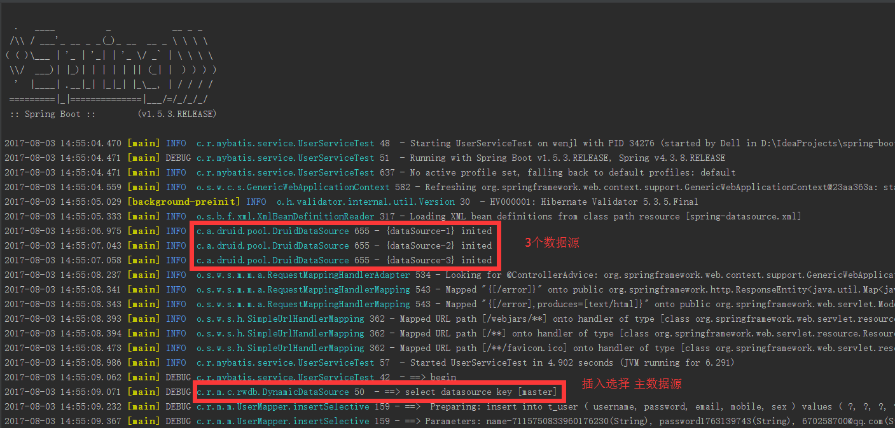
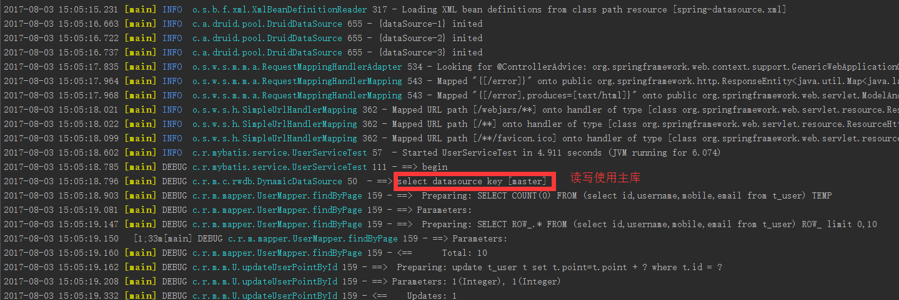
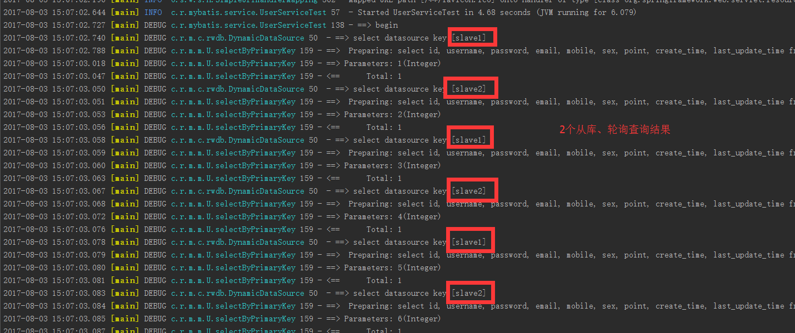
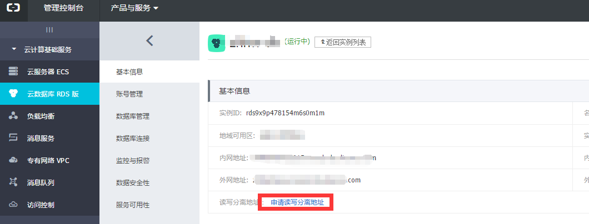

# Spring Boot + Mybatis + Druid 实现MySQL一主多从读写分离

## Spring Boot 读写分离实现

### 原理
实现方式主要是通过扩展Spring [AbstractRoutingDataSource](http://docs.spring.io/spring/docs/current/javadoc-api//org/springframework/jdbc/datasource/lookup/AbstractRoutingDataSource.html)   
这个类充当DataSource路由中介，在运行当中根据自定义KEY值动态切换正真的DataSource。

## 具体实现

### 创建测试库、表：   

    create database `mytest_db`;
    
    CREATE TABLE `t_user` (
      `id` int(11) NOT NULL AUTO_INCREMENT,
      `username` varchar(32) NOT NULL DEFAULT '' COMMENT '用户名',
      `password` varchar(32) NOT NULL DEFAULT '' COMMENT '密码',
      `email` varchar(64) NOT NULL DEFAULT '' COMMENT '邮箱',
      `mobile` varchar(16) NOT NULL DEFAULT '' COMMENT '手机号',
      `sex` tinyint(1) NOT NULL DEFAULT '1' COMMENT '性别 0 女 1男',
      `point` int(11) NOT NULL DEFAULT '0' COMMENT '用户积分',
      `create_time` datetime NOT NULL DEFAULT CURRENT_TIMESTAMP COMMENT '创建时间',
      `last_update_time` datetime NOT NULL DEFAULT CURRENT_TIMESTAMP ON UPDATE CURRENT_TIMESTAMP COMMENT '最后更新时间',
      PRIMARY KEY (`id`)
    ) ENGINE=InnoDB AUTO_INCREMENT=1 DEFAULT CHARSET=utf8mb4
    ;

### Spring DataSource 配置：

刚开始使用全注解版实现DataSource配置，后面发现需要增加从库还需要改代码，最终选择了使用配置文件。注解版后面我也会贴出来。

**DataSource配置文件 [spring-datasource.xml](http://git.oschina.net/rainwen/spring-boot-showcase/blob/master/spring-mybatis/src/main/resources/spring-datasource.xml)**

    <?xml version="1.0" encoding="UTF-8"?>
    <beans xmlns="http://www.springframework.org/schema/beans"
           xmlns:xsi="http://www.w3.org/2001/XMLSchema-instance"
           xsi:schemaLocation="http://www.springframework.org/schema/beans
               http://www.springframework.org/schema/beans/spring-beans.xsd">
    
        <!-- 主数据源配置 -->
        <bean id="masterDataSource" class="com.alibaba.druid.pool.DruidDataSource" destroy-method="close" init-method="init" primary="true">
            ...省略
        </bean>
    
        <!-- 从数据源配置 -->
        <bean id="slaveDataSource1" class="com.alibaba.druid.pool.DruidDataSource" destroy-method="close" init-method="init">
            ...省略
        </bean>
    
        <!-- 从数据源配置 -->
        <bean id="slaveDataSource2" class="com.alibaba.druid.pool.DruidDataSource" destroy-method="close" init-method="init">
            ...省略
        </bean>
    
        <!-- 数据源注入到动态数据源 -->
        <bean id="dynamicDataSource" class="com.rainwen.mybatis.configration.rwdb.DynamicDataSource">
            <property name="targetDataSources">
                <map>
                    <entry key="master" value-ref="masterDataSource"/>
                    <entry key="slave1" value-ref="slaveDataSource1"/>
                    <entry key="slave2" value-ref="slaveDataSource2"/>
                </map>
            </property>
            <property name="slaveDataSources">
                <list>
                    <value>slave1</value>
                    <value>slave2</value>
                </list>
            </property>
            <!-- 设置默认数据源 -->
            <property name="defaultTargetDataSource" ref="masterDataSource"/>
        </bean>
    
    </beans>
    
**注解版数据源配置**

    /**
     * 多数据源配置，此方式省去配置文件，但灵活性不够
     * Created by rain.wen on 2017/7/31.
     */
    @Configuration
    public class DataSourceConfiguration {
    
        @Bean(name = "masterDataSource", destroyMethod = "close", initMethod = "init")
        @Primary // 这个注解表示主数据源
        @ConfigurationProperties(prefix = "druid.datasource")
        public DataSource datasource() {
            return new DruidDataSource();
        }
    
        @Bean(name = "slaveDataSource", destroyMethod = "close", initMethod = "init")
        @ConfigurationProperties(prefix = "druid.datasource2")
        public DataSource datasource2() {
            return new DruidDataSource();
        }
    
        /**
         * 构建动态数据源
         * @param masterDataSource
         * @param slaveDataSource
         * @return
         */
        @Bean
        public DynamicDataSource dynamicDataSource(@Qualifier("masterDataSource") DataSource masterDataSource,
                                                   @Qualifier("slaveDataSource") DataSource slaveDataSource) {
            DynamicDataSource dynamicDataSource = new DynamicDataSource();
            Map<Object, Object> targetDataSources = new HashMap<Object, Object>();
    
            targetDataSources.put("master", masterDataSource);
            targetDataSources.put("slave1", slaveDataSource);
            dynamicDataSource.setTargetDataSources(targetDataSources);
    
            List<Object> slaveDataSources = new ArrayList<Object>();
            slaveDataSources.add("slave1");
    
            dynamicDataSource.setDefaultTargetDataSource(masterDataSource);
            dynamicDataSource.setSlaveDataSources(slaveDataSources);
    
            return dynamicDataSource;
    
        }
    
    }

    
**[DynamicDataSource](http://git.oschina.net/rainwen/spring-boot-showcase/blob/master/spring-mybatis/src/main/java/com/rainwen/mybatis/configration/rwdb/DynamicDataSource.java)实现：** 
主要是实现动态数据源切换

    /**
     * 动态数据源路由，读写使用主库，只读使用从库
     * <pre>
     *      轮训算法详解: https://github.com/wtstengshen/blog-page/wiki/Round-Robin
     *
     *      Netflix ribbon: https://www.oschina.net/p/ribbon
     * </pre>
     *
     * Created by rain.wen on 2017/7/31.
     */
    public class DynamicDataSource extends AbstractRoutingDataSource {
    
        public final static Logger logger = LoggerFactory.getLogger(DynamicDataSource.class);
        /**
         * 从数据源
         */
        private List<Object> slaveDataSources = new ArrayList<Object>();
        /**
         * 轮询计数
         */
        private AtomicInteger squence = new AtomicInteger(0);
    
        @Override
        public void afterPropertiesSet() {
            super.afterPropertiesSet();
        }
    
        @Override
        protected Object determineCurrentLookupKey() {
            Object key = "";
            //主库
            if (DynamicDataSourceHolder.isMaster()) {
                key = DynamicDataSourceHolder.MASTER;
            } else {
                //从库
                key = getSlaveKey();
            }
            logger.debug("==> select datasource key [{}]", key);
            return key;
        }
    
        public void setSlaveDataSources(List<Object> slaveDataSources) {
            this.slaveDataSources = slaveDataSources;
        }
    
        /**
         * 轮询获取从库
         *
         * @return
         */
        public Object getSlaveKey() {
            if (squence.intValue() == Integer.MAX_VALUE) {
                synchronized (squence) {
                    if (squence.intValue() == Integer.MAX_VALUE) {
                        squence = new AtomicInteger(0);
                    }
                }
            }
            int idx = squence.getAndIncrement() % slaveDataSources.size();
            return slaveDataSources.get(idx);
        }
    }

**DynamicDataSourceHolder**   
这个类主要是用于记录当前线程操作的是需要操作主库还是从库，核心是通过 ThreadLocal 记录
    
    /**
     * 动态数据源操作
     * Created by rain.wen on 2017/7/31.
     */
    public class DynamicDataSourceHolder {
    
        /**
         * 主数据库标识
         */
        public static final String MASTER = "master";
    
        /**
         * 从数据库标识
         */
        public static final String SLAVE = "slave";
    
        private static final ThreadLocal<String> holder = new ThreadLocal<String>();
    
        private DynamicDataSourceHolder() {
            //
        }
    
        public static void putDataSource(String key) {
            holder.set(key);
        }
    
        public static String getDataSource() {
            return holder.get();
        }
    
        public static void clearDataSource() {
            holder.remove();
        }
    
        public static boolean isMaster(){
            return holder.get().equals(MASTER);
        }
    
    }
 

**DynamicDataSourceTransactionManager 动态数据源事物管理**
**在开启事务的时候，根据只读事务、读写事务 选择操作是主库还是从库**

    /**
     * 动态数据源事务管理
     * Created by rain.wen on 2017/7/31.
     */
    public class DynamicDataSourceTransactionManager extends DataSourceTransactionManager {
    
        /**
         * 只读事务到读库，读写事务到写库
         * @param transaction
         * @param definition
         */
        @Override
        protected void doBegin(Object transaction, TransactionDefinition definition) {
            //设置数据源
            boolean readOnly = definition.isReadOnly();
            if(readOnly) {
                DynamicDataSourceHolder.putDataSource(DynamicDataSourceHolder.SLAVE);
            } else {
                DynamicDataSourceHolder.putDataSource(DynamicDataSourceHolder.MASTER);
            }
            super.doBegin(transaction, definition);
        }
    
        /**
         * 清理本地线程的数据源
         * @param transaction
         */
        @Override
        protected void doCleanupAfterCompletion(Object transaction) {
            super.doCleanupAfterCompletion(transaction);
            DynamicDataSourceHolder.clearDataSource();
        }
    }

**动态DataSource 注入到MyBatis、以及事务配置**
主要是容器启动配置

    /**
     * 动态数据源注入MyBatis、事务配置
     * Created by rocky on 14-5-29.
     */
    @Configuration
    @EnableTransactionManagement(proxyTargetClass = true)
    public class PlatformDynamicDataSourceConfiguration {
    
        @Bean
        public SqlSessionFactoryBean sqlSessionFactory(@Qualifier("dynamicDataSource") DynamicDataSource dataSource) throws SQLException, IOException {
            SqlSessionFactoryBean sqlSessionFactoryBean = new SqlSessionFactoryBean();
            sqlSessionFactoryBean.setDataSource(dataSource);
            Properties properties = new Properties();
            properties.setProperty("sqlType", "mysql");
            sqlSessionFactoryBean.setConfigurationProperties(properties);
            sqlSessionFactoryBean.setPlugins(new Interceptor[]{new PaginationInterception()});
            return sqlSessionFactoryBean;
        }
    
        @Bean
        public DynamicDataSourceTransactionManager transactionManager(@Qualifier("dynamicDataSource") DynamicDataSource dataSource) {
            DynamicDataSourceTransactionManager dynamicDataSourceTransactionManager = new DynamicDataSourceTransactionManager();
            dynamicDataSourceTransactionManager.setDataSource(dataSource);
            return dynamicDataSourceTransactionManager;
        }
    
    }

### 测试

#### 插入测试
    
    /**
     * 插入
     */
    @Test
    public void saveTest() {
        logger.debug("==> begin");
        Random random = new Random();
        for (int i = 0; i < 10; i++) {
            User user = new User();
            user.setUsername("name" + random.nextLong());
            user.setPassword("password" + random.nextInt());
            user.setMobile("18888888888");
            user.setSex(random.nextInt(2));
            user.setEmail(random.nextInt(1000000000) + "@qq.com");
            userService.save(user);
        }
        logger.debug("==> end");
    }
    
---

**测试结果**   

#### 查询更新测试：

        /**
         * 查出前10位并更新积分
         */
        @Test
        public void updateUserPointTest() {
            logger.debug("==> begin");
            int size = userService.updateUserPoint();
            Assert.isTrue(size > 0,"");
            logger.debug("==> end");
        }
---

**测试结果**   

     
#### 从库轮询测试：

        /**
         * 从数据库轮询测试
         */
        @Test
        public void findByIdSlaveRoundRobinTest(){
            logger.debug("==> begin");
            for(int i = 1 ; i < 10 ; i++){
                Integer id = i;
                User user = userService.findById(id);
                Assert.isTrue(user != null,"");
            }
            logger.debug("==> end");
        }

---

**测试结果**   

#### 更多测试：[UserServiceTest](http://git.oschina.net/rainwen/spring-boot-showcase/blob/master/spring-mybatis/src/test/java/com/rainwen/mybatis/service/UserServiceTest.java)

## MySQL主从模式配置
安装环境:Windows 
MySQL5.6.21 解压版, 复制两份(主库master、从库slave)

注意事项：   

    1.主从数据库版本保持一致   
    2.my.ini 配置 server_id 保持唯一   
    3.主从数据库开始数据保持一致   

### 主库配置：
修改bin/my.ini

    [client]
    port=3306
   
    [mysqld]
    port=3306
    
    #主从数据库标识
    server-id=101
    #指定同步数据库，不配置则同步全部数据库
    binlog-do-db=mytest_db
    #开启主从复制
    log-bin=mysql3306-bin

### 主库创建从库同步用户

授权用户slave01使用123456密码登录mysql

    grant replication slave on *.* to 'slave01'@'127.0.0.1'identified by '123456'
    flush privileges;

### 查询主数据库当前状态

    mysql> SHOW MASTER STATUS;
    +----------------------+----------+--------------+------------------+-------------------+
    | File                 | Position | Binlog_Do_DB | Binlog_Ignore_DB | Executed_Gtid_Set |
    +----------------------+----------+--------------+------------------+-------------------+
    | mysql3306-bin.000007 |      120 | mytest_db    |                  |                   |
    +----------------------+----------+--------------+------------------+-------------------+
    1 row in set
    
**Position 120 代表从库开始同步位置**

### 从库配置

修改mysql/data/auto.cnf 保证uuid唯一 [原因](http://blog.csdn.net/cug_jiang126com/article/details/46846031)
 
    [auto]
    server-uuid=f937232b-55ce-11e4-b7bb-0025ab047cc1wjl

修改bin/my.ini，在末尾增加如下配置   

    [client]
    port=3307
   
    [mysqld]
    port=3307
    server-id=102
    
启动从库，打开命令行，执行SQL：

    mysql> CHANGE MASTER TO master_host='127.0.0.1', master_user='slave01', master_password='123456', master_port=3306, master_log_file='mysql3306-bin.000007', master_log_pos=120;
    Query OK, 0 rows affected

启动从库同步：

    mysql> START SLAVE;
    Query OK, 0 rows affected

查看从库状态：

    mysql> SHOW SLAVE STATUS\G;
    *************************** 1. row ***************************
                   Slave_IO_State: Waiting for master to send event
                      Master_Host: 127.0.0.1
                      Master_User: slave01
                      Master_Port: 3306
                    Connect_Retry: 60
                  Master_Log_File: mysql3306-bin.000007
              Read_Master_Log_Pos: 120
                   Relay_Log_File: wenjl-relay-bin.000002
                    Relay_Log_Pos: 287
            Relay_Master_Log_File: mysql3306-bin.000007
                 Slave_IO_Running: Yes
                Slave_SQL_Running: Yes

**Slave_IO_Running: Yes**   
**Slave_SQL_Running: Yes**

2个Yes配置成功

## 阿里云读写分离完美结合

如果目前在使用阿里云 云数据RDS 可以直接申请读写分离  

## 代码
[spring-boot-mybatis](http://git.oschina.net/rainwen/spring-boot-showcase/tree/master/spring-mybatis)

主要参考：
> http://www.jianshu.com/p/2222257f96d3   
> http://blog.csdn.net/jack85986370/article/details/51559232
